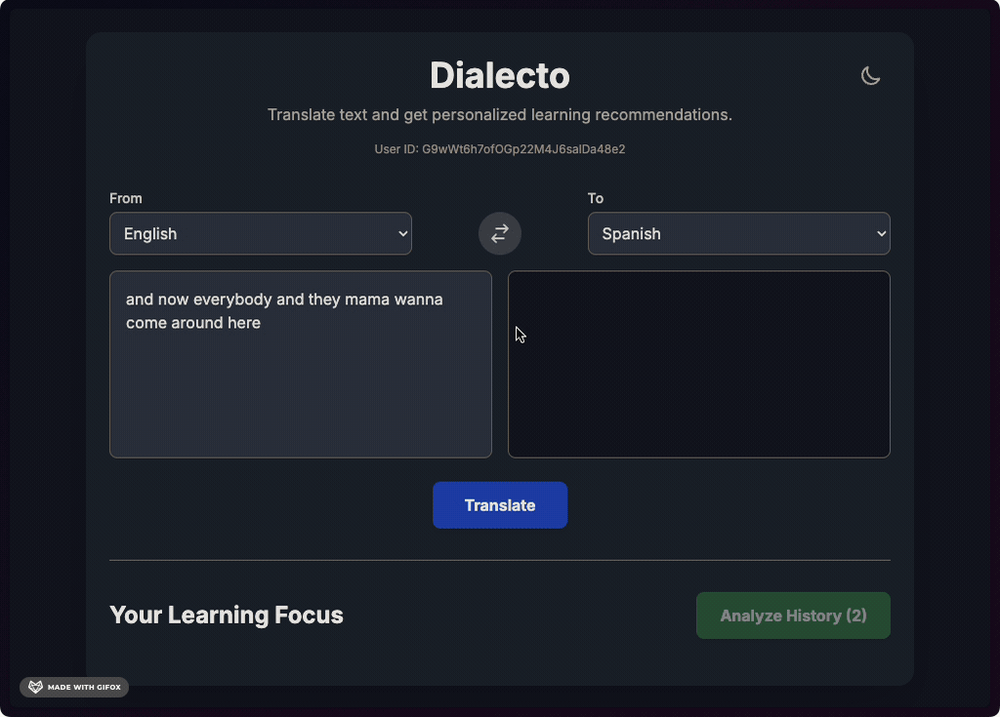
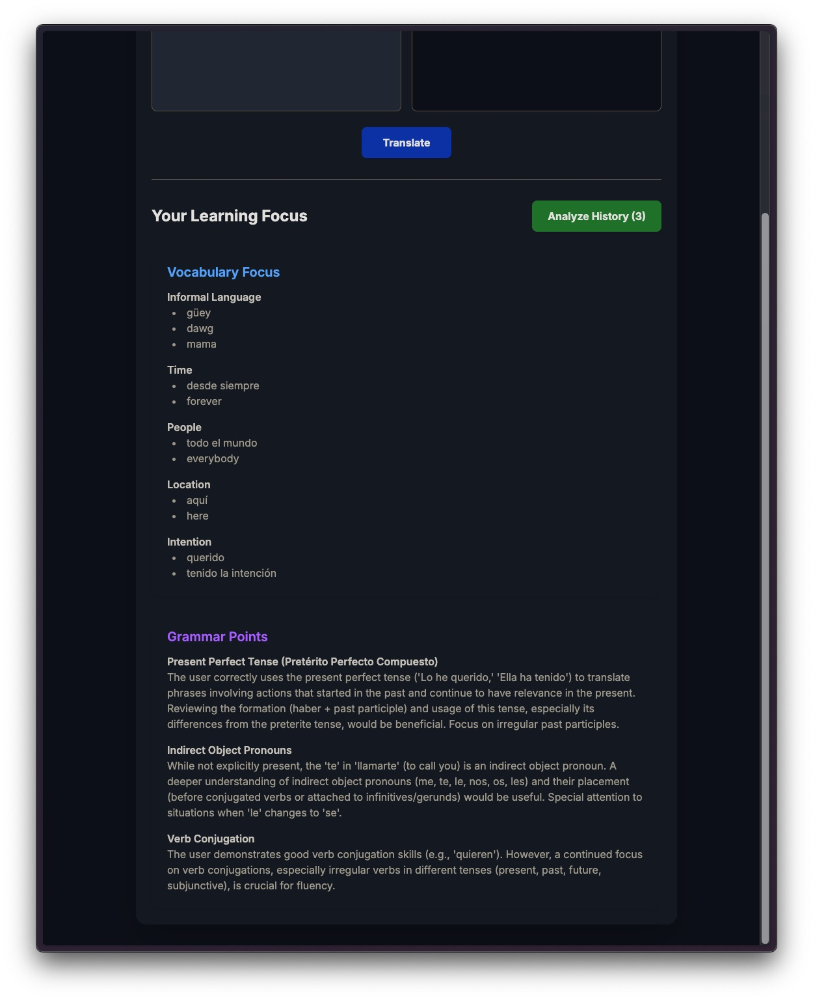
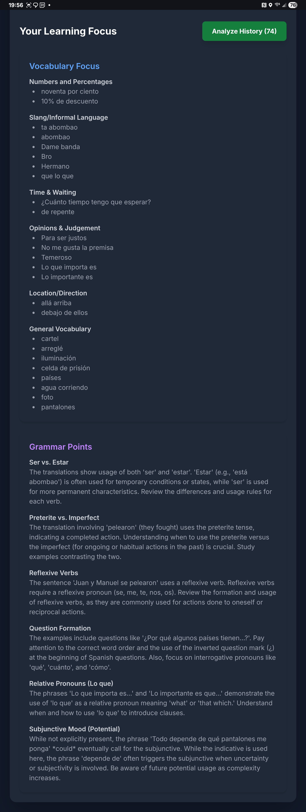
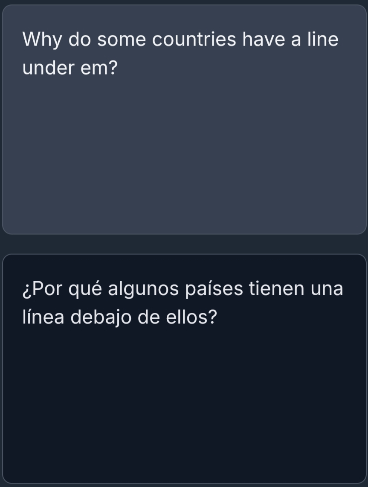
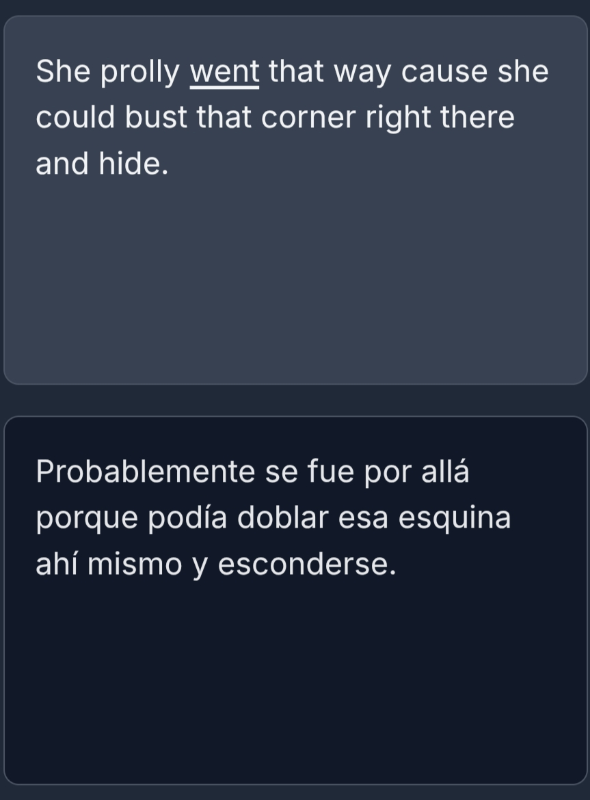
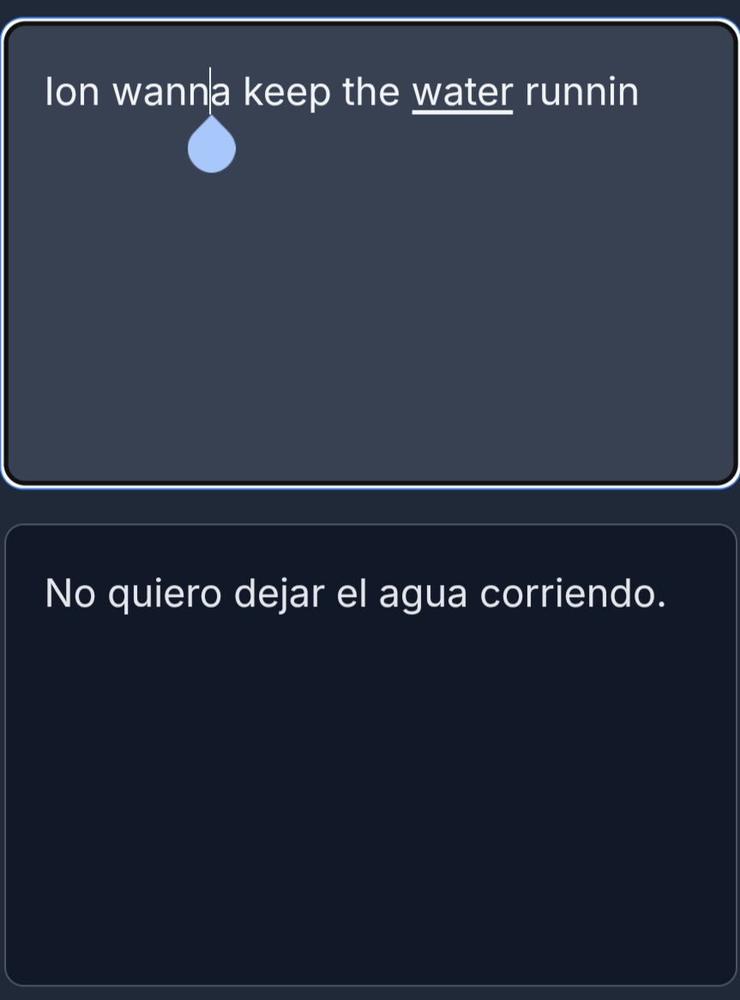
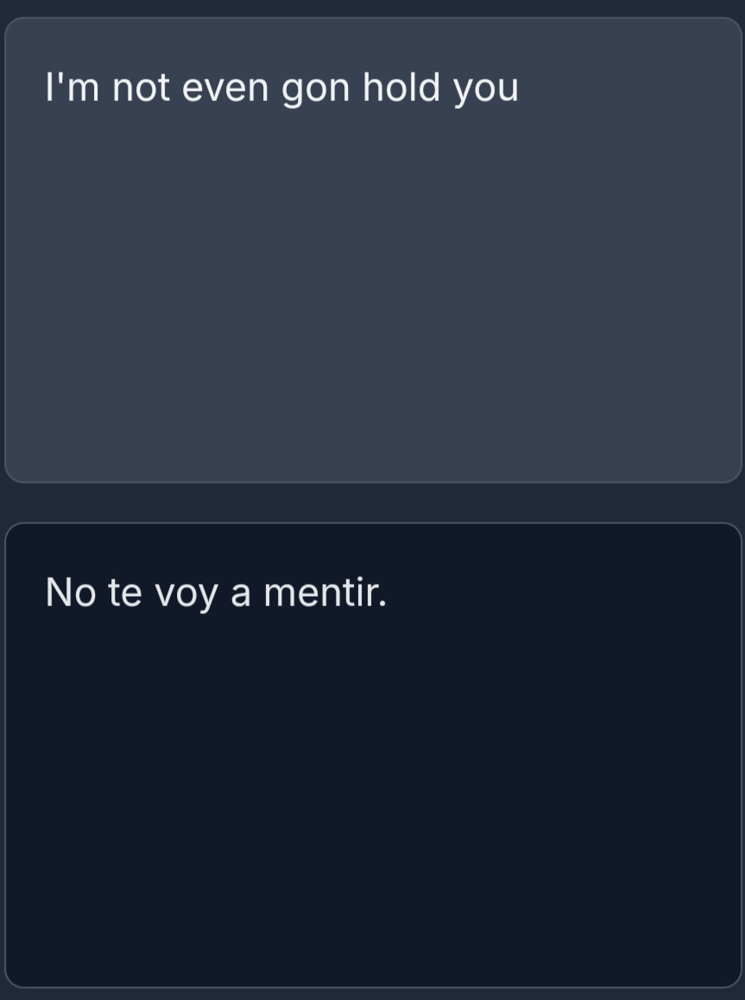
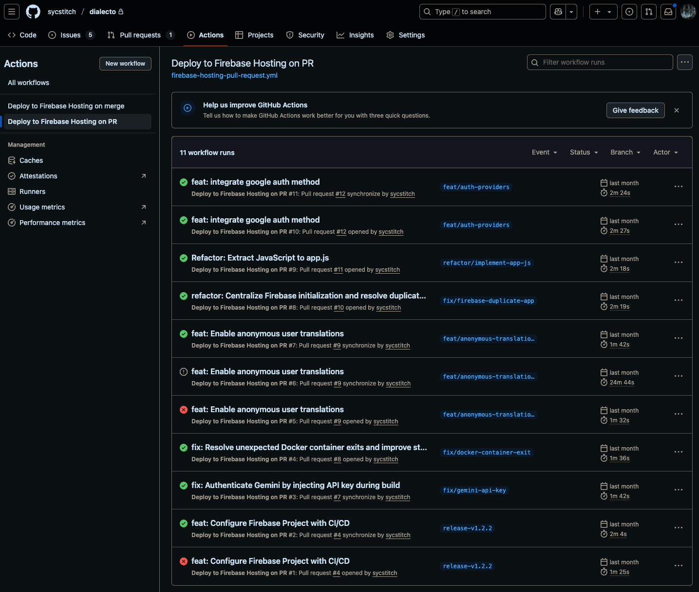
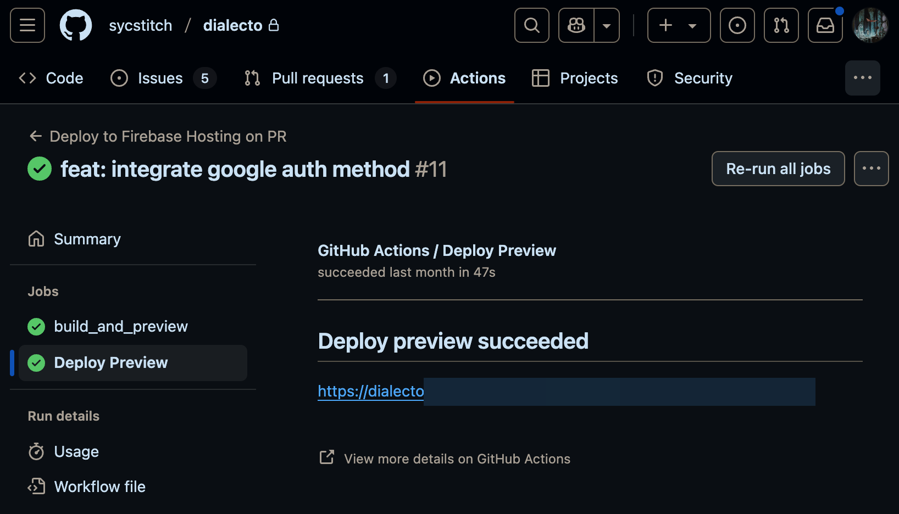

# dialecto-preview


[](https://github.com/sycstitch/dialecto/actions/workflows/firebase-hosting-pull-request.yml)
[](https://github.com/sycstitch/dialecto/actions/workflows/firebase-hosting-merge.yml)

This is a preview of my project called Dialecto, a unique take on a translator made to be linguistically aware of dialects. Currently, there are security risks with the app not exposed through git, but will be if app is faced to the public. Once those are wrinkled out, you'll be able to try it out for yourself! :D

<br></br>
## Demo
### Computer
(Recorded with Gifox but limited on time, so recommendations are shown with the screenshot)
| Live Demo                                         | Recommendations                                                |
| :-----------------------------------------------: | :------------------------------------------------------------: |
|  |  |

### Phone
| Live Demo                                                            | Recommendations                                                                                                   |
| :------------------------------------------------------------------: | :---------------------------------------------------------------------------------------------------------------: |
| [YouTube Link](https://youtube.com/shorts/9YXpPo1dNyo?feature=share) |  |

### Unique Translations
Translations are even accurate coming from English slang! Most is from AAVE, which I speak.

<table>
  <tr>
    <td style="width: 50%; vertical-align: top; padding: 10px;">
      
      <p style="text-align: center;">"em"</p>
    </td>
    <td style="width: 50%; vertical-align: top; padding: 10px;">
      
      <p style="text-align: center;">"prolly", "bust that corner"</p>
    </td>
  </tr>
  <tr>
    <td style="width: 50%; vertical-align: top; padding: 10px;">
      
      <p style="text-align: center;">"Ion", "wanna", "runnin"</p>
    </td>
    <td style="width: 50%; vertical-align: top; padding: 10px;">
      
      <p style="text-align: center;">"not (even) gon hold you"</p>
    </td>
  </tr>
</table>

<br></br>
## CI/CD Pipeline

This project uses GitHub Actions for automated testing, building, and deployment with separate workflows for pull requests and production releases.

### Key Features
- **Pull Request Validation**: Every PR triggers automated builds with live preview deployments
- **Production Deployment**: Successful merges automatically deploy to the main Firebase hosting environment
- **Consistent Success Rate**: Maintained 100% successful deployment rate across all features and refactors

<details>
<summary>📊 View Pipeline Screenshots</summary>

**Workflow Overview**
<p align="center">
  
  <br>
  <em>All PR workflow runs demonstrating reliable CI/CD pipeline performance</em>
</p>

**Live Preview Generation**
<p align="center">
  
  <br>
  <em>Automated preview deployments provide immediate access to live testing environments</em>
</p>

</details>

### Technical Implementation
- **Build Process**: `npm ci` → `npm run build` → Firebase deployment
- **Preview URLs**: Each PR generates a unique preview URL for stakeholder review
- **Deployment Target**: Firebase Hosting with custom domain support

See my [personal workflow](https://github.com/sycstitch/guides/blob/main/dev/personal-workflow.md) I follow for my project.

<br></br>
## Areas for Future Development

This project is continuously evolving, and I have many exciting improvements planned. Here are some key areas I'm focusing on:

### Language and Translation Accuracy

My primary goal is to provide highly accurate and contextually relevant translations.

* **Enhanced Contextual Understanding:** I'm actively working to improve the model's ability to understand nuances and slang, like ensuring "dame banda" is consistently translated as "give me space" rather than a literal "give me band."
* **Robust Typo Detection:** The system will become more forgiving of minor typos. For instance, "dam**a** banda" should prompt a suggestion for "dam**e** banda" rather than a direct, incorrect translation.
* **Model Optimization:** I'm exploring alternative AI models with superior language capabilities, balancing translation quality with cost-effectiveness.
* **Broader Dialect Support:** Integrating more normalized dialectal data will significantly enhance the accuracy and breadth of translations for various regional expressions.

### User Experience and Personalization

Improving how users interact with and learn from the application is crucial.

* **Culturally Relevant Explanations:** To address the current English-centric explanations, I plan to implement a multi-select dropdown menu allowing users to specify their known languages. This will enable concept explanations to be tailored to their linguistic and cultural background, using more familiar analogies and examples.

### User Interface (UI) Refinements

A seamless and visually appealing interface is essential for a positive user experience.

* **Responsive Layouts:** I'll be refining the UI to ensure the background color consistently fills the entire screen on all display sizes.
* **Optimized Button Placement:** The layout for authentication buttons (e.g., "Sign in with Google") will be adjusted to better accommodate various screen dimensions, ensuring all elements are clearly visible without impacting text size.

### Core Functionality and Data Management

Enhancing core features and efficient data handling are high priorities.

* **Persistent User Data:** Completing the "Sign in with Google" integration will allow users' translation history to be saved across sessions, even if their browser cache is cleared.
* **Intelligent History Management:** I'm planning to implement a system that automatically prunes less frequently accessed translations from a user's history after a certain period, optimizing storage space.

### Security Enhancements

Ensuring the security of user data and API keys is paramount.

* **Secure API Key Management:** I will be implementing robust protocols for the secure storage and usage of all API keys to protect sensitive information.

<br></br>
## Project Structure
```
.
├── .firebaserc
├── .git/
├── .github/
│   └── workflows/
│       ├── firebase-hosting-merge.yml
│       └── firebase-hosting-pull-request.yml
├── documentation/
│   ├── roadmap.md
│   ├── skills-used.md
│   ├── troubleshooting.md
│   └── versions.md
├── docker-compose.yml
├── Dockerfile
├── entrypoint.sh
├── firebase.json
├── firebase-debug.log
├── firestore-debug.log
├── node_modules/
├── package.json
├── package-lock.json
├── public/
│   ├── config.js             # Auto-generated, ignored
│   ├── index.html
│   └── main.js
├── src/
│   ├── config.local.js       # My real keys (ignored)
│   └── config.local.js.example
└── README.md
```
