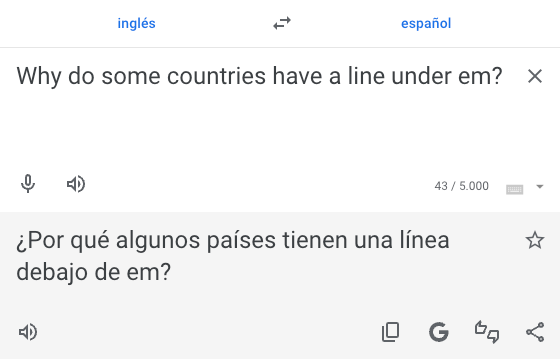
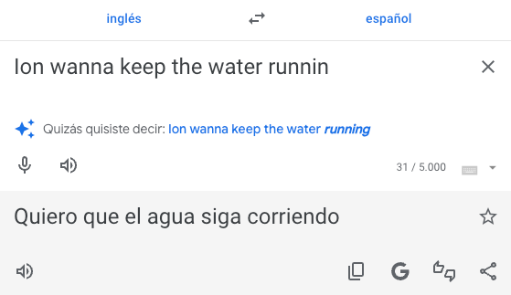
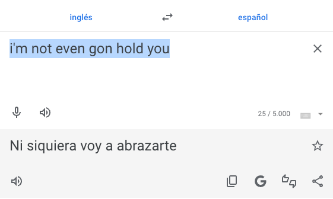
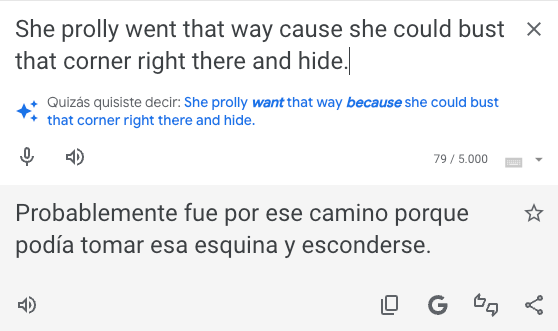

# Dialecto - Translation App Preview


> *This is a preview repository showcasing the functionality and technical implementation of my dialect-aware translation application. The full codebase remains private due to security considerations during development.*

**Dialecto** is a unique take on translation technology, designed to be linguistically aware of dialects and cultural context. Unlike traditional translators, it accurately handles regional expressions, slang, and cultural nuances - particularly excelling with **AAVE** (African American Vernacular English) and **Dominican Spanish** variations.


## 🚀 Technical Highlights

- **Custom CI/CD Pipeline**: Achieved 100% deployment success rate with automated preview generation
- **Cultural Dialect Recognition**: Advanced handling of AAVE, Dominican Spanish, and regional expressions
- **Cross-Platform Responsive Design**: Seamless experience across desktop and mobile devices  
- **Firebase Integration**: Real-time deployment with preview URLs for stakeholder review
- **Docker Containerization**: Consistent development and deployment environments


## 🎬 Demo

### Desktop Experience
| Live Demo                                         | Smart Recommendations                                          |
| :-----------------------------------------------: | :------------------------------------------------------------: |
|  |  |

### Mobile Experience
| Live Demo                                                            | Smart Recommendations                                                                                             |
| :------------------------------------------------------------------: | :---------------------------------------------------------------------------------------------------------------: |
| [📱 YouTube Demo](https://youtube.com/shorts/9YXpPo1dNyo?feature=share) |  |


## ⚡ Dialect Translation Accuracy vs Google Translate

My app significantly outperforms Google Translate when handling cultural dialects and slang. Here's a direct comparison:

### AAVE (African American Vernacular English) Examples

<table>
  <tr>
    <td style="width: 50%; vertical-align: top; padding: 15px;">
      
      <p style="text-align: center;"><strong>✅ Dialecto:</strong> "em" → "them" ("ellos")</p>
    </td>
    <td style="width: 50%; vertical-align: top; padding: 15px;">
      
      <p style="text-align: center;"><strong>❌ Google Translate:</strong> "em" → cannot translate (misses cultural context)</p>
    </td>
  </tr>
  <tr>
    <td style="width: 50%; vertical-align: top; padding: 15px;">
      
      <p style="text-align: center;"><strong>✅ Dialecto:</strong> "Ion wanna..." → "I don't want to keep the water running"</p>
    </td>
    <td style="width: 50%; vertical-align: top; padding: 15px;">
      
      <p style="text-align: center;"><strong>❌ Google Translate:</strong> "Ion wanna..." → "I want the water to keep running" (opposite meaning!)</p>
    </td>
  </tr>
  <tr>
    <td style="width: 50%; vertical-align: top; padding: 15px;">
      
      <p style="text-align: center;"><strong>✅ Dialecto:</strong> "not (even) gon hold you" → "I'm not going to lie to you..."</p>
    </td>
    <td style="width: 50%; vertical-align: top; padding: 15px;">
      
      <p style="text-align: center;"><strong>❌ Google Translate:</strong> "not (even) gon hold you" → "I'm not going to hold you" (literal translation)</p>
    </td>
  </tr>
  <tr>
    <td style="width: 50%; vertical-align: top; padding: 15px;">
      
      <p style="text-align: center;"><strong>✅ Dialecto:</strong> "bust that corner" → "turn on the corner"</p>
    </td>
    <td style="width: 50%; vertical-align: top; padding: 15px;">
      
      <p style="text-align: center;"><strong>❌ Google Translate:</strong> "bust that corner" → Overly formal translation, misses casual tone</p>
    </td>
  </tr>
</table>

### 🎯 Key Competitive Advantages
- **Google Translate**: Provides literal word-for-word translations that lose cultural meaning
- **Dialecto**: Recognizes dialectal patterns and provides culturally aware translations
- **Real Example**: My app recognized "Qué lo que?" as a common Dominican Spanish greeting → Google returned "what what?"


## 📁 Project Structure

```
.
├── .firebaserc
├── .git/
├── .github/
│   └── workflows/
│       ├── firebase-hosting-merge.yml
│       └── firebase-hosting-pull-request.yml
├── documentation/
│   ├── roadmap.md
│   ├── skills-used.md
│   ├── troubleshooting.md
│   └── versions.md
├── docker-compose.yml
├── Dockerfile
├── entrypoint.sh
├── firebase.json
├── firebase-debug.log
├── firestore-debug.log
├── node_modules/
├── package.json
├── package-lock.json
├── public/
│   ├── config.js             # Auto-generated, ignored
│   ├── index.html
│   └── main.js
├── src/
│   ├── config.local.js       # My real keys (ignored)
│   └── config.local.js.example
└── README.md
```


## 🔄 CI/CD Pipeline

This project uses **GitHub Actions** for automated testing, building, and deployment with separate workflows for pull requests and production releases.

### ✨ Key Features
- **Pull Request Validation**: Every PR triggers automated builds with live preview deployments
- **Production Deployment**: Successful merges automatically deploy to the main Firebase hosting environment
- **Consistent Success Rate**: Maintained 100% successful deployment rate across all features and refactors

<details>
<summary>📸 View Pipeline Screenshots</summary>

<br>

**Workflow Overview**
<p align="center">
  
  <br>
  <em>All PR workflow runs demonstrating reliable CI/CD pipeline performance</em>
</p>

**Live Preview Generation**
<p align="center">
  
  <br>
  <em>Automated preview deployments provide immediate access to live testing environments</em>
</p>

</details>

### 🔧 Technical Implementation
- **Build Process**: `npm ci` → `npm run build` → Firebase deployment
- **Preview URLs**: Each PR generates a unique preview URL for stakeholder review
- **Deployment Target**: Firebase Hosting with custom domain support

> 💡 See my [personal workflow](https://github.com/sycstitch/guides/blob/main/dev/personal-workflow.md) that I follow for this project.


## 🚧 Areas for Future Development

This project is continuously evolving, and I have many exciting improvements planned:

### 🎯 Language and Translation Accuracy

* **Enhanced Contextual Understanding** — Improving the model's ability to understand nuances and slang, like ensuring "dame banda" is consistently translated as "give me space" rather than literal "give me band"

* **Robust Typo Detection** — Making the system more forgiving of minor typos (e.g., "dam**a** banda" should suggest "dam**e** banda")

* **Model Optimization** — Exploring alternative AI models with superior language capabilities while balancing cost-effectiveness

* **Broader Dialect Support** — Integrating more normalized dialectal data for various regional expressions

### 👤 User Experience and Personalization

* **Culturally Relevant Explanations** — Implementing multi-select dropdown for users to specify known languages, enabling culturally tailored concept explanations

### 🎨 User Interface Refinements

* **Responsive Layouts** — Ensuring background color consistently fills entire screen on all display sizes

* **Optimized Button Placement** — Adjusting authentication button layouts for various screen dimensions

### ⚙️ Core Functionality and Data Management

* **Persistent User Data** — Completing "Sign in with Google" integration for cross-session translation history

* **Intelligent History Management** — Auto-pruning less frequently accessed translations to optimize storage

### 🔒 Security Enhancements

* **Secure API Key Management** — Implementing robust protocols for secure storage and usage of all API keys
