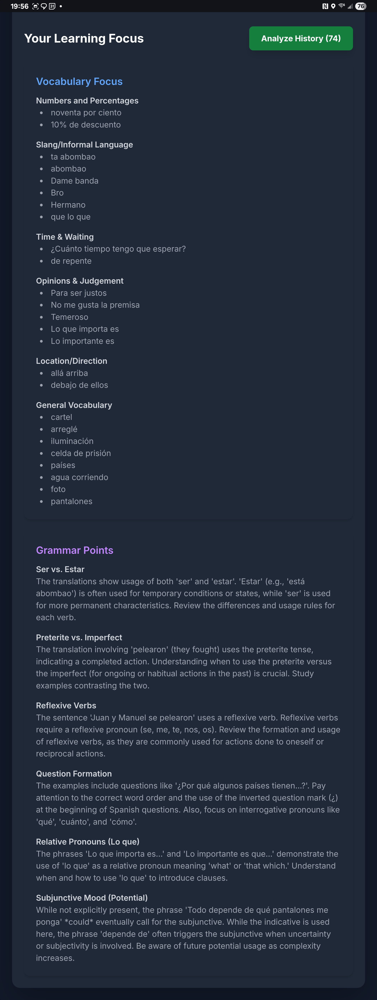
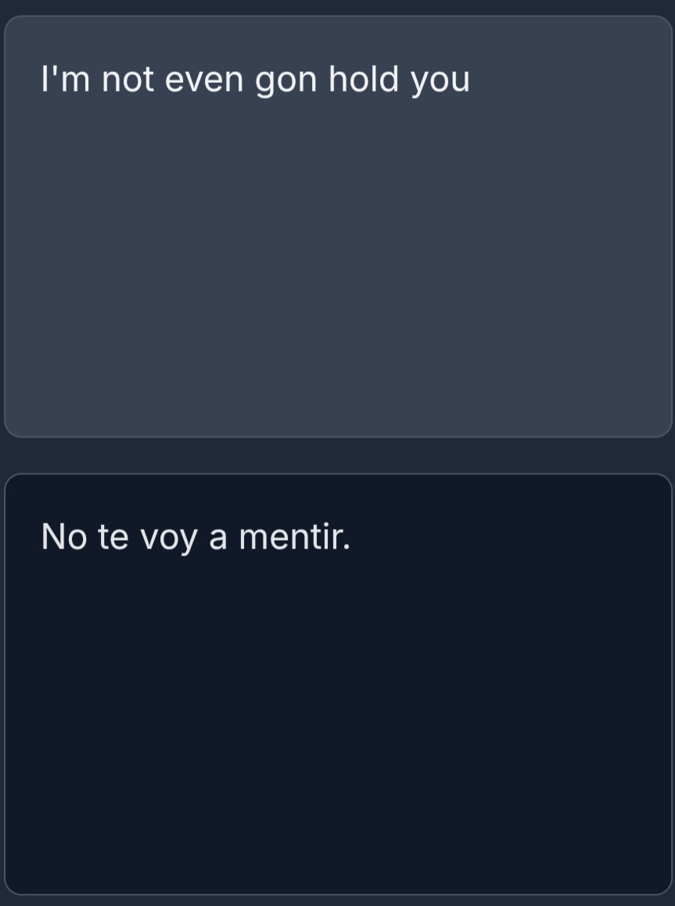

# dialecto-preview

## Description
This is a preview of my project called Dialecto, a unique take on a translator made to be linguistically aware of dialects. Currently, there are security risks with the app not exposed through git, but will be if app is faced to the public. Once those are wrinkled out, you'll be able to try it out for yourself! :D


## Demo
### Computer
(Recorded with Gifox but limited on time, so recommendations are shown with the screenshot)
| Live Demo                                         | Recommendations                                                |
| ------------------------------------------------- | -------------------------------------------------------------- |
|  |  |

### Phone
| Live Demo                                             | Recommendations                                                                                                   |
| ----------------------------------------------------- | ----------------------------------------------------------------------------------------------------------------- |
| [YouTube link](https://youtube.com/shorts/9YXpPo1dNyo?feature=share) |  |

### Unique Translations
Translations are even accurate coming from English slang! Most is from AAVE, which I speak.
|  "em"                         |  "prolly", "bust that corner"  |
| --------------------------------------------------------------------------------------- | ---------------------------------------------------------------------------------------- |
|  **"Ion", "wanna", "runnin"** |  **"not (even) gon hold you"** |

## CI/CD Pipeline
| Build and Preview                                          | Deploy Preview Site                                  |
| ---------------------------------------------------------- | ---------------------------------------------------- |
|  |  |

## Areas of Improvement


## 📁 Project Structure
```
.
├── .firebaserc
├── .git/
├── .github/
│   └── workflows/
│       ├── firebase-hosting-merge.yml
│       └── firebase-hosting-pull-request.yml
├── documentation/
│   ├── roadmap.md
│   ├── skills-used.md
│   ├── troubleshooting.md
│   └── versions.md
├── docker-compose.yml
├── Dockerfile
├── entrypoint.sh
├── firebase.json
├── firebase-debug.log
├── firestore-debug.log
├── node_modules/
├── package.json
├── package-lock.json
├── public/
│   ├── config.js             # Auto-generated, ignored
│   ├── index.html
│   └── main.js
├── src/
│   ├── config.local.js       # My real keys (ignored)
│   └── config.local.js.example
└── README.md
```
